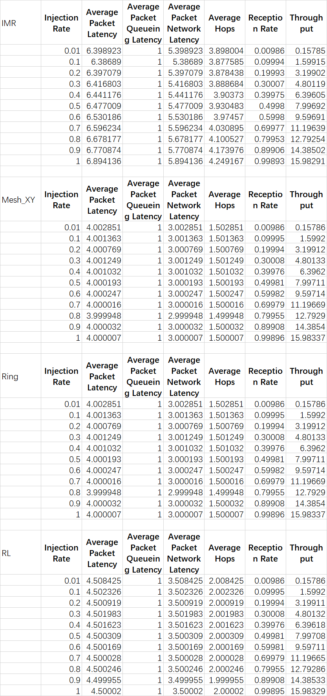

# Tutorial to Reproduce the Results

## Generating the Raw Data

After applying the patch, you need to modify the path in `gem5/src/mem/ruby/network/garnet/Router.hh`:

```cpp
std::string filename;
      // Modify the path to your own ABSOLUTE path
      switch (routing_algorithm)
      {
      case IMR_:
        filename = "/home/s2022011336/gem5/Experiment Data/IMR/routing_table.txt";
        break;
      case ROUTERLESS_:
        filename = "/home/s2022011336/gem5/Experiment Data/Routerless/routing_table.txt";
        break;
      default:
        return;
      }
```

Then, after **BUILDING**, you need to modify  scripts `simulate.sh` and `generate_imr.sh` in the `gem5` directory. First is the `simulate.sh` script:

```bash
#!/bin/bash

topology="Mesh_XY" # Available options: Mesh_XY, Ring, IMR, Routerless
algorithm=1 # 1: Mesh_XY, 3: Ring, 4: IMR, 5: Routerless
mesh_rows=4 # Options: 4, 6, 8
mode="tornado" # Available modes: uniform_random, shuffle, transpose, tornado, neighbor
injection_rates=(0.01 0.1 0.2 0.3 0.4 0.5 0.6 0.7 0.8 0.9 1) # Specify desired injection rates

# Additional code

./build/NULL/gem5.opt \
    configs/example/garnet_synth_traffic.py \
    --link-width-bits=$link_width_bits \
    --vcs-per-vnet=$vcs_per_vnet \
    --router-latency=$router_latency \
    --network=garnet --num-cpus=16 --num-dirs=16 \ # Use num-cpus=mesh_rows^2, num-dirs=16 when mesh_rows=4, and num-dirs=32 when mesh_rows=6 or 8
    --topology=$topology \
    --routing-algorithm=$algorithm \
    --inj-vnet=0 --synthetic=$mode \
    --sim-cycles=5000000 --injectionrate=$injectionrate \
    --mesh-rows=$mesh_rows # Enable this line only when topology=Mesh_XY

# Additional code
```

For example, if you want to reproduce the results `results_Routerless_algo_5_tornado_N=8.txt`, you need to modify the `simulate.sh` as follows:

```bash
#!/bin/bash

topology="Routerless"
algorithm=5
mesh_rows=8
mode="tornado"
injection_rates=# appropriate injection rates
vcs_per_vnet=4
router_latency=1
link_width_bits=128
output="results_$topology""_algo_$algorithm""_$mode""_N=$mesh_rows.txt"

rm -f $output
echo "link_width_bits=$link_width_bits" >> $output

for injectionrate in "${injection_rates[@]}"
do
    echo "Running simulation with injectionrate = $injectionrate"

    ./build/NULL/gem5.opt \
    configs/example/garnet_synth_traffic.py \
    --link-width-bits=$link_width_bits \
    --vcs-per-vnet=$vcs_per_vnet \
    --router-latency=$router_latency \
    --network=garnet --num-cpus=64 --num-dirs=32 \
    --topology=$topology \
    --routing-algorithm=$algorithm \
    --inj-vnet=0 --synthetic=$mode \
    --sim-cycles=5000000 --injectionrate=$injectionrate \
    #--mesh-rows=$mesh_rows

# no need to modify the following codes
```

Note that you need to manually modify the injection rates in the `simulate.sh` script to match the injection rates in the given `gem5/results/Routerless/results_Routerless_algo_5_tornado_N=8.txt` file.

Moreover, if you want to reproduce the results of IMR, you need to modify the `generate_imr.sh` script:

```bash
python ./configs/topologies/ConstructIMR.py \
--N 6 \ # 4, 6, 8
--k 23 \ # 9, 23, 43
--p 0.2 \ # 0.2, 0.5
--num_solution 32 \ # 32, 8
--lam 0.01 \
--lam_1 1 \
--objective 'variance' \ # 'variance', ''
--file_path './Experiment Data/IMR/test.txt' \
--gen_num 1000 \
# 4 - 9, 6 - 23, 8 - 43
```

Refer to the report for more details about the meaning of the parameters and how they influence the results.

**Note**: Each time you run generate_imr.sh, the original corresponding files will be overwritten. Make sure to back up the original files if you need to keep them. It’s recommended to reproduce the results in an organized and sequential manner.

After running the `generate_imr.sh` script, you can get the raw data by executing the `simulate.sh` script.

**Note**: Sometimes the simulation may throw a deadlock error. This is because the network is too congested. Then you should modify the `simulate.sh` script to reduce the injection rates. Also note that each time you run the simulation, the results will be overwritten. Make sure to back up the original files if you need to keep them.

## Generating the Plots

After generating the raw data, you need to convert the raw data into Excel files, and the format of the Excel files should be as follows (the attached `data_frame.py` script may help, but after all you need to do it manually):



Each combination of the $N$ and synthetic traffic pattern should be in a separate sheet (Refer to the attached Excel file for guidance).

Then, you can generate the plots using the attached three python scripts: `plot_hop.py`, `plot_latency.py`, and `plot_throughput.py`. Make sure your Excel file is named `results.xlsx` and is in the same directory as the python scripts.

## Generating the Evolutionary Algorithm Results

Please refer to `gem5/Experiment Data/IMR/test.txt` for the scores and the edge counts of the solutions. Then you can use any tools to visualize the results. And the content of attached `Experiment Data/bestIMR*.txt` may help.
